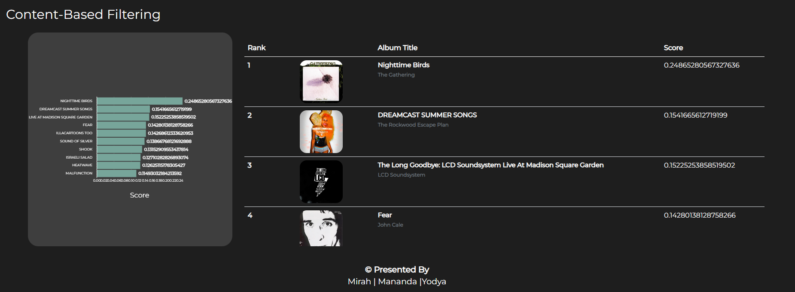
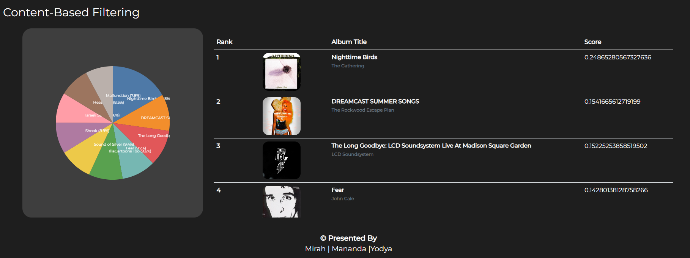

# Song Album Recommendation System 

Recommendation systems in music platforms play an important 
role in building better relationships between users and platforms, 
as well as between artists and listeners. 
This research focuses on creating a song album recommendation system 
using Content-Based Filtering and Collaborative Filtering methods. 
The dataset used in this research is taken from the Album of The Year (AOTY) website. 
The establishment of a recommendation system using both methods shows that 
Content-Based Filtering can recommend relevant song albums according to user preference albums, 
while Collaborative Filtering can recommend relevant song albums according to other user ratings. 
This recommendation system is expected to help users find new song albums that match their preferences.

# How To Run Code

- ### Steps
  - Install requirement
    ```
    pip install -r requirement.txt
    ```
  - Change Directory
    ```
    cd .\03-aoty-visualization\
    ```
    ```
    cd .\myproject\
    ```

  - Run server
    ```
    python manage.py runserver 
    ```
    
# Album Recommendation System Interface
## Exploration Page


## Detail Album Page


## Recommendation Page
### Overall Statistic Section


### Collaborative Filtering Section


### Content-Based Filtering Section


